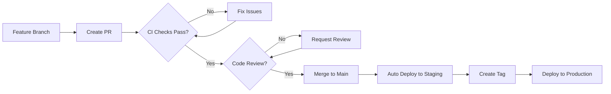

# Branch Protection Setup

This guide explains how to set up branch protection rules for the `main` branch to ensure code quality and security.

## GitHub Branch Protection Rules

Go to your repository → **Settings** → **Branches** → **Add rule**

### Rule Configuration for `main` branch:

#### **Basic Settings**
- ✅ **Branch name pattern**: `main`
- ✅ **Restrict pushes that create matching branches**

#### **Protect matching branches**
- ✅ **Require a pull request before merging**
  - ✅ **Require approvals**: 1 (or more for teams)
  - ✅ **Dismiss stale PR approvals when new commits are pushed**
  - ✅ **Require review from code owners** (we have CODEOWNERS file)
  - ✅ **Restrict reviews to users with write access**

- ✅ **Require status checks to pass before merging**
  - ✅ **Require branches to be up to date before merging**
  - **Required status checks**:
    - `test` (from CI workflow)
    - `setup-build-publish-deploy` (if using deployment checks)

- ✅ **Require conversation resolution before merging**

- ✅ **Require signed commits** (recommended for security)

- ✅ **Require linear history** (prevents merge commits, cleaner history)

- ✅ **Include administrators** (applies rules to admin users too)

#### **Restrict pushes**
- ✅ **Restrict pushes that create matching branches**
- Add specific users/teams who can push (usually just CI/CD service accounts)

#### **Rules applied to specific people and teams**
- Add exceptions if needed (usually none for main branch)

## Alternative: Using GitHub CLI

You can also set up branch protection programmatically:

```bash
# Install GitHub CLI if not already installed
# brew install gh  # macOS
# apt install gh   # Ubuntu

# Authenticate
gh auth login

# Set up branch protection
gh api repos/:owner/:repo/branches/main/protection \
  --method PUT \
  --field required_status_checks='{"strict":true,"contexts":["test"]}' \
  --field enforce_admins=true \
  --field required_pull_request_reviews='{"required_approving_review_count":1,"dismiss_stale_reviews":true,"require_code_owner_reviews":true}' \
  --field restrictions=null \
  --field allow_force_pushes=false \
  --field allow_deletions=false
```

## Alternative: Using Terraform

For infrastructure-as-code approach:

```hcl
resource "github_branch_protection" "main" {
  repository_id = "postfiatorg/ipfs-gcs"
  pattern       = "main"

  required_status_checks {
    strict = true
    contexts = [
      "test",
      # Add other CI check names here
    ]
  }

  required_pull_request_reviews {
    required_approving_review_count = 1
    dismiss_stale_reviews          = true
    require_code_owner_reviews     = true
    restrict_reviews_to_code_owners = true
  }

  enforce_admins = true

  allows_deletions    = false
  allows_force_pushes = false
  require_conversation_resolution = true
  require_signed_commits = true
  required_linear_history = true
}
```

## What These Rules Prevent

✅ **Direct pushes to main** - All changes must go through PRs
✅ **Merging failing CI** - Tests must pass
✅ **Merging without review** - At least 1 approval required
✅ **Bypassing code owners** - CODEOWNERS must approve
✅ **Force pushes** - Prevents history rewriting
✅ **Branch deletion** - Prevents accidental deletion
✅ **Unresolved conversations** - All PR comments must be resolved

## Workflow After Protection

### For Contributors:
1. **Fork the repo** or create feature branch
2. **Make changes** in your branch
3. **Create PR** to main
4. **Wait for CI** to pass (required)
5. **Request review** from code owners
6. **Address feedback** and resolve conversations
7. **Merge after approval** (only then allowed)

### For Maintainers:
1. **Review PRs** thoroughly
2. **Check CI status** (automatic)
3. **Test changes** if needed
4. **Approve and merge** or request changes
5. **Monitor deployments** (automatic after merge)

## Emergency Procedures

### Hotfix Process:
1. Create hotfix branch from main
2. Make minimal fix
3. Create PR with "hotfix" label
4. Get expedited review
5. Merge and tag for immediate deployment

### Admin Override:
- Admins can temporarily disable protection for emergency fixes
- **Always re-enable immediately after**
- Document the reason in issues/discussions

## Integration with CI/CD

The branch protection works seamlessly with our CI/CD:



## Monitoring and Metrics

Track these metrics to ensure healthy development:

- **PR merge time** (should be reasonable)
- **CI failure rate** (should be low)
- **Review response time** (should be quick)
- **Hotfix frequency** (should be minimal)

Use GitHub Insights → Pulse and Network tabs to monitor.

## Team Guidelines

### For Code Reviews:
- Review for **functionality, security, performance**
- Check **tests are included**
- Verify **documentation is updated**
- Ensure **no secrets** are committed
- Validate **coding standards** are followed

### For PRs:
- **Small, focused changes** (easier to review)
- **Clear description** of what and why
- **Link to issues** if applicable
- **Self-review** before requesting review
- **Keep up to date** with main branch

## Troubleshooting

### Common Issues:

1. **"Required status check is failing"**
   - Check CI logs in Actions tab
   - Fix failing tests or linting issues
   - Push new commits to update status

2. **"Review required but no reviewers available"**
   - Add more users to CODEOWNERS
   - Request review from specific team members
   - Admin can temporarily modify requirements

3. **"Cannot merge due to conflicts"**
   - Update branch with latest main
   - Resolve conflicts locally
   - Push updated branch

4. **"Signed commits required"**
   - Set up GPG signing: `git config --global commit.gpgsign true`
   - Or temporarily disable if needed

### Admin Commands:

```bash
# Check current protection status
gh api repos/:owner/:repo/branches/main/protection

# Temporarily disable protection (emergency only)
gh api repos/:owner/:repo/branches/main/protection --method DELETE

# Re-enable protection
# (Use the PUT command from earlier)
```